<!-- STREAMING_CHUNK:Updating introduction figure link to JPG format... -->
<!-- ... existing code ... -->
The servomechanism relies on potentiometer position sensors acting as voltage dividers to measure input command angle $\phi_1(t)$ and output shaft rotation $\phi_2(t)$. 

  
*Figure 1: Control Design of a Servo System.*

An operational amplifier generates an amplified driving voltage:
<!-- ... existing code ... -->
### 2.1 Block Diagram Representation (GA 5.1 Diagrams & Engineering Sketches)

  
*Figure 2: Block diagram of the servomechanism.*

---
<!-- ... existing code ... -->
<!-- STREAMING_CHUNK:Updating position feedback figure links to JPG format... -->
#### Position Feedback Design

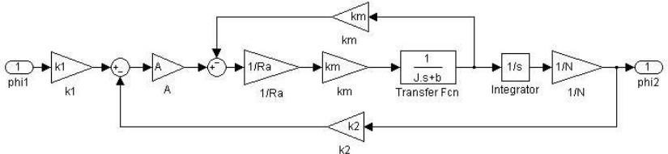  
*Figure 3: SIMULINK implementation for position feedback design.*

Combining the inner motor loop yields:
$$H_{\text{inner}}(s) = \frac{\frac{k_m}{R_a J}}{s + \frac{R_a b + k_m^2}{R_a J}}$$

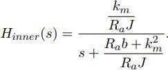  
*Figure 4: Representation of block diagram after inner loop reduction.*

The overall closed-loop transfer function is:
$$H(s) = \frac{\frac{A k_1 k_m}{R_a J N}}{s^2 + \frac{R_a b + k_m^2}{R_a J} s + \frac{A k_2 k_m}{R_a J N}}$$

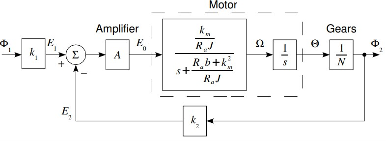  
*Figure 5: SIMULINK comparison confirming zero difference between block diagram and derived transfer function.*

Analytical equations used for parameter determination:
* **Static Gain:** $k = \frac{k_1}{k_2} = 1$
* **Undamped Natural Frequency:** $\omega_n = \sqrt{\frac{k_2 A B}{N}} = \sqrt{\frac{k_2 A k_m}{J N R_a}}$
* **Damping Ratio:** $\zeta = \frac{R_a b + k_m^2}{2 R_a J \sqrt{\frac{k_2 A k_m}{N R_a J}}}$

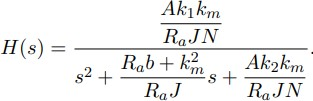  
*Figure 6: MATLAB code script for parameter calculation.*

```matlab
<!-- ... existing code ... -->
<!-- STREAMING_CHUNK:Updating rate feedback figure links to JPG format... -->
#### Rate Feedback Design

  
*Figure 7: SIMULINK implementation with rate feedback loop.*

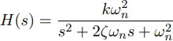  
*Figure 8: Reduced block diagram for rate feedback design.*

Transfer function with rate feedback constant $k_r$:
$$H_{\text{rate}}(s) = \frac{\frac{k_1 A B}{N}}{s^2 + (C + A B k_r) s + \frac{k_2 A B}{N}}$$

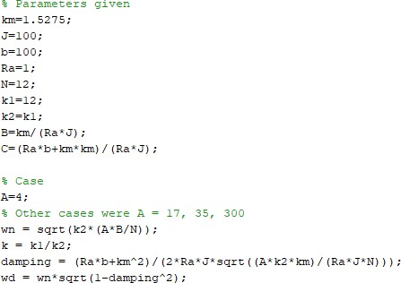  
*Figure 9: SIMULINK comparison with rate feedback transfer function.*

Damping ratio with rate feedback:
$$\zeta = \frac{R_a b + k_m^2 + A k_r k_m}{2 R_a J \sqrt{\frac{k_2 A k_m}{N R_a J}}}$$

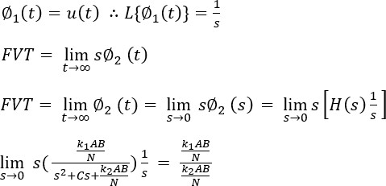  
*Figure 10: MATLAB parameter script for Rate Feedback design.*

---
<!-- ... existing code ... -->
<!-- STREAMING_CHUNK:Updating scope plot references to JPG format... -->
##### Scope Plots (Position Feedback)

* **Gain $A = 4$ (Overdamped):**  
  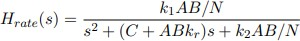  
  *Settling time $\approx 95$ s with zero overshoot or oscillation.*

* **Gain $A = 17$ (Critically Damped):**  
  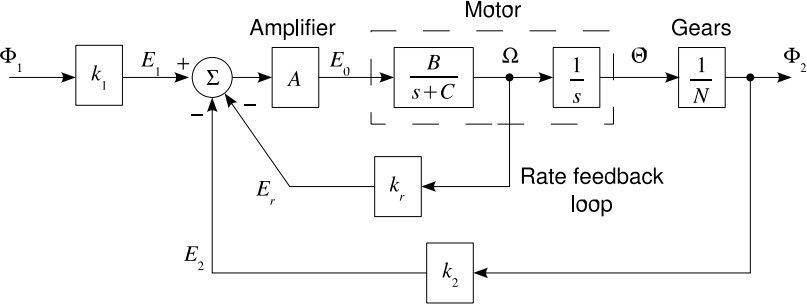  
  *Settling time $\approx 20$ s with fastest non-oscillatory step response.*

* **Gain $A = 35$ (Underdamped):**  
    
  *Settling time $\approx 15$ s featuring light overshoot before stabilization.*

* **Gain $A = 300$ (Highly Underdamped):**  
  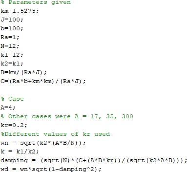  
  *Rapid rise time with significant overshoot ($\approx 46\%$) and persistent oscillations before settling at 17 s.*

---

#### Rate Feedback Experiments

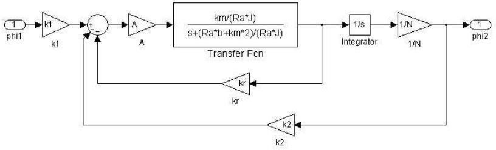  
*Figure 11: SIMULINK comparison setup for step responses with/without rate feedback.*

* **Low Rate Feedback ($k_r = 0.6$):**  
  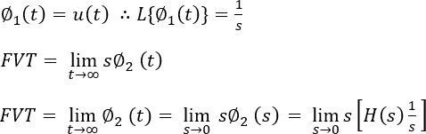  
  *Response remains slightly underdamped, stabilizing around 15 seconds.*

* **High Rate Feedback ($k_r = 6.0$):**  
  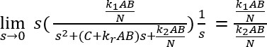  
  *Overdamped response; settling time extended beyond 30 seconds.*

---
<!-- ... existing code ... -->