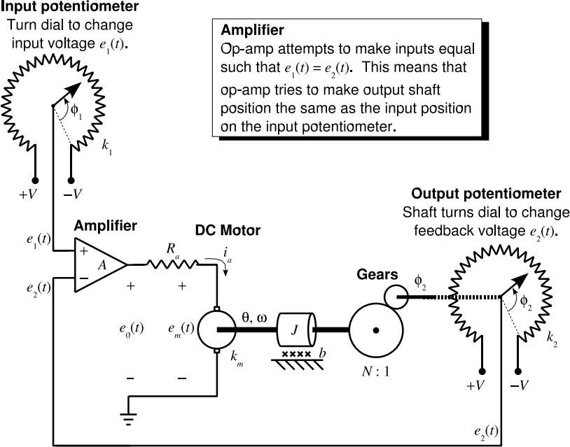
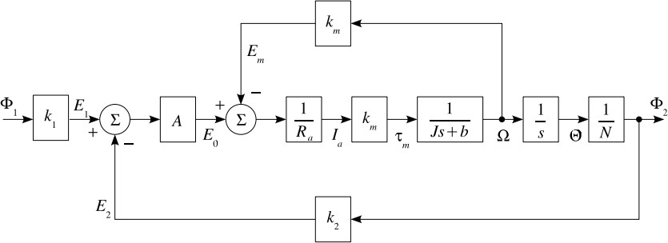
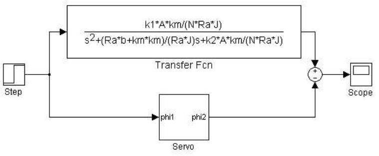
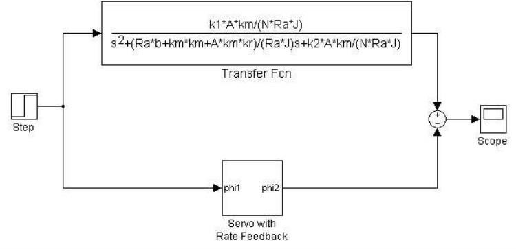
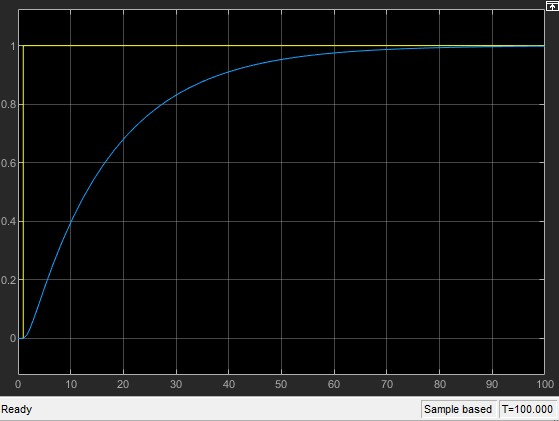
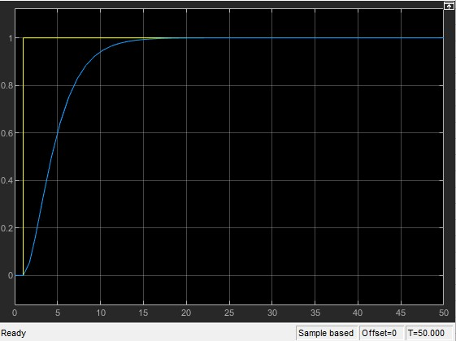
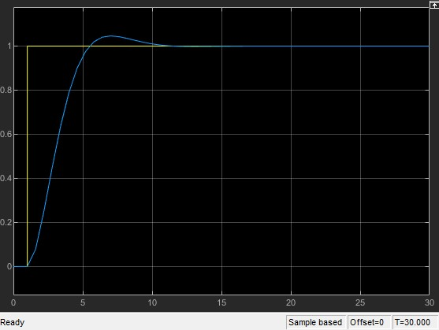
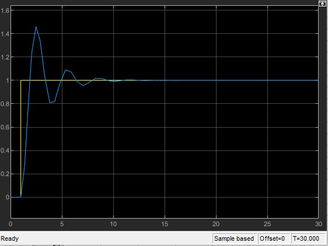
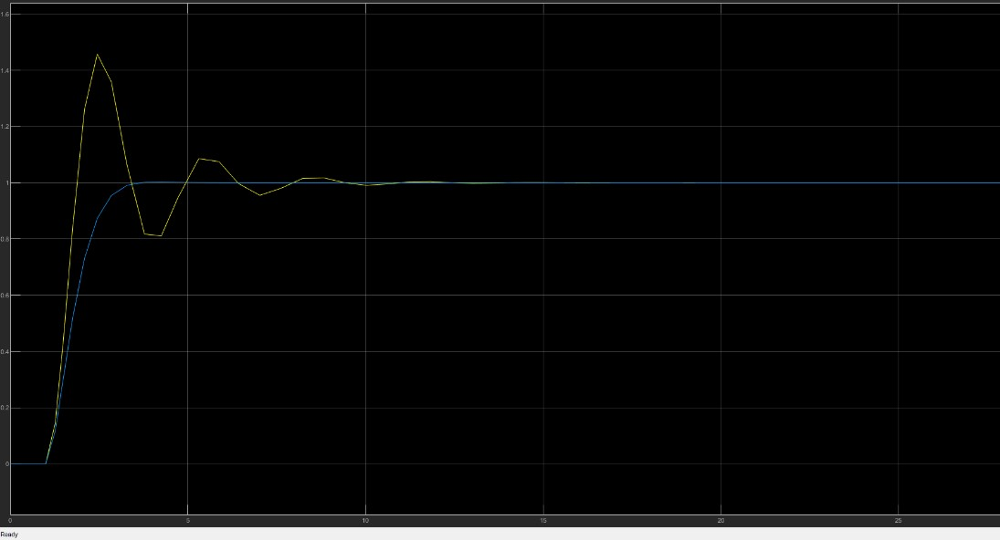
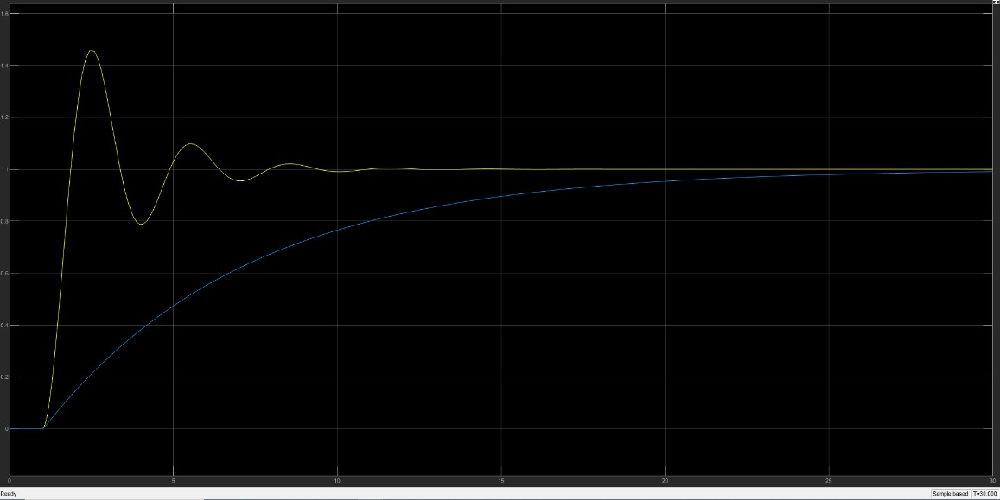

# LAB #2: SERVO SYSTEM SIMULATION
**Course:** SYSC 3600  
**Submitted by:** JABER UL HUDA (101102329)

---

## 1.0 Introduction (GA 2.1 Problem Definition)

This laboratory examines the dynamics of a position controller for a motor. The objective is to test the dynamics of the system with the help of a designed controller. The servo system is analyzed using rate feedback and positive feedback through a digital simulation in Simulink. The static gain, undamped natural frequency, and damping ratio are determined using block diagrams and transfer functions.

---

## 2.0 Controller Design (GA 4.4 Design Solution)

A servomechanical system is used as the control design. In such a system, an electrical input is provided to generate a mechanical output. Figure 1 illustrates such a system.

  
*Figure 1. Control Design of a Servo system.*

In this control system, an input potentiometer is used. The angular position of the output shaft is controlled by turning the dial to set the input voltage $e_1(t)$ of the input potentiometer.

The input potentiometer works by turning the dial and placing the wiper arm at different positions along the potentiometer's resistive elements, allowing a voltage to be generated in the range of $[+V, -V]$.

The output potentiometer works in the same way as the input potentiometer to generate $e_2(t)$. The only difference is that the output potentiometer is controlled by the rotation of the motor shaft. $e_1(t)$ corresponds to an input angle of $\phi_1(t)$ and $e_2(t)$ corresponds to an output angle of $\phi_2(t)$. Both signals are fed into the amplifier, and the difference between the signals is amplified. Hence, the amplified voltage signal can be expressed as:

$$e_0(t) = A [e_1(t) - e_2(t)]$$

From this equation, we can conclude:

* **Case 1:** $e_1(t) = e_2(t)$  
  *Result:* $e_0(t) = 0$. The motor will not turn.
* **Case 2:** $e_1(t) > e_2(t)$  
  *Result:* $e_0(t)$ is positive. As a result, the motor will turn clockwise. As the motor rotates in the clockwise direction, the output shaft rotates in the positive direction, leading to an increase in the value of $e_2(t)$.
* **Case 3:** $e_1(t) < e_2(t)$  
  *Result:* $e_0(t)$ is negative. As a result, the motor will turn counter-clockwise. This causes the output shaft to rotate in the negative direction, thereby decreasing the value of $e_2(t)$.

---

### 2.1 Block Diagram of Controller (GA 5.1 Diagrams and Engineering Sketches)

Figure 2 illustrates the block diagram of the servo system.

  
*Figure 2. Block Diagram for the servo system.*

The block diagram in Figure 2 shows that the rotations of the input and output potentiometers are fed into the amplifier, which drives the motor rotation.

---

## 3.0 Results

### 3.1 MATLAB/Simulink Implementation (GA 5.3 Tools for Design, Experimentation, Visualization, Simulation, and Analysis)

#### Position Feedback Design
First, we analyze the position feedback design of the servomechanism. Figure 3 shows the block diagram built in SIMULINK to simulate the response.

  
*Figure 3. Block Diagram for position feedback design.*

From Figure 3, we determine that there are two nested feedback loops which can be reduced to find the overall transfer function response.

The inner feedback loop transfer function is given as:

$$H_{\text{inner}}(s) = \frac{\frac{k_m}{R_a J}}{s + \frac{R_a b + k_m^2}{R_a J}}$$

The reduced block diagram after forming the inner feedback loop is shown in Figure 4.

  
*Figure 4. Representation of block diagram after reduction.*

After further block reduction, the transfer function of the outer feedback loop can be written as:

$$H(s) = \frac{\frac{k_1 A B}{N}}{s^2 + C s + \frac{k_2 A B}{N}}$$

where:
$$B = \frac{k_m}{R_a J}, \quad C = \frac{R_a b + k_m^2}{R_a J}$$

Hence, the overall transfer function of Figure 2 can be written as:

$$H(s) = \frac{\frac{A k_1 k_m}{R_a J N}}{s^2 + \frac{R_a b + k_m^2}{R_a J} s + \frac{A k_2 k_m}{R_a J N}}$$

After designing the system (Figure 3), both the block diagram and the reduced transfer function were simulated together to compare step responses. Figure 5 shows the Simulink comparison layout.

  
*Figure 5. Simulink simulation to compare the step response of the block diagram.*

Comparing the overall transfer function to the standard second-order system equation:

$$H(s) = \frac{k \omega_n^2}{s^2 + 2\zeta \omega_n s + \omega_n^2}$$

we obtain expressions for the static gain ($k$), undamped natural frequency ($\omega_n$), and damping ratio ($\zeta$):

$$k = \frac{k_1}{k_2}$$

$$\omega_n = \sqrt{\frac{k_2 A B}{N}} = \sqrt{\frac{k_2 A k_m}{J N R_a}}$$

$$\zeta = \frac{R_a b + k_m^2}{2 R_a J} \cdot \frac{1}{\sqrt{\frac{A k_2 k_m}{N R_a J}}} = \frac{C}{2 \omega_n}$$

The parameters were evaluated in MATLAB as shown below:

```matlab
% Parameters given
km = 1.5275;
J = 100;
b = 100;
Ra = 1;
N = 12;
k1 = 12;
k2 = k1;
B = km / (Ra * J);
C = (Ra * b + km * km) / (Ra * J);

% Case
A = 4;
% Other cases were A = 17, 35, 300
wn = sqrt(k2 * (A * B / N));
k = k1 / k2;
damping = (Ra * b + km^2) / (2 * Ra * J * sqrt((A * k2 * km) / (Ra * J * N)));
wd = wn * sqrt(1 - damping^2);
```
*Figure 6. MATLAB code for static gain, natural frequency (damped and undamped) and the damping ratio.*

To find the final steady-state value for $\phi_2(t)$, we apply the Final Value Theorem (FVT) for Laplace transforms, where the input is a unit step function $\phi_1(t) = u(t) \implies \Phi_1(s) = \frac{1}{s}$:

$$\text{FVT} = \lim_{t \to \infty} \phi_2(t) = \lim_{s \to 0} s \Phi_2(s) = \lim_{s \to 0} s \left[ H(s) \frac{1}{s} \right]$$

$$\text{FVT} = \lim_{s \to 0} \left( \frac{\frac{k_1 A B}{N}}{s^2 + C s + \frac{k_2 A B}{N}} \right) = \frac{\frac{k_1 A B}{N}}{\frac{k_2 A B}{N}} = \frac{k_1}{k_2}$$

Since $k_1 = k_2$, the final value is equal to **1**.

---

#### Rate Feedback Design

The second configuration analyzed is the rate feedback design. Figure 7 shows the block diagram for rate feedback.

  
*Figure 7. Block Diagram for rate feedback design.*

Combining the feedback loops yields the closed-loop transfer function:

$$H_{\text{rate}}(s) = \frac{\frac{k_1 A B}{N}}{s^2 + (C + A B k_r) s + \frac{k_2 A B}{N}}$$

The reduced block diagram for the rate feedback design is shown in Figure 8.

  
*Figure 8. Block diagram of Rate feedback design after reduction.*

Both the physical block simulation and the transfer function model were run simultaneously to compare step responses. Figure 9 shows the comparison setup in Simulink.

  
*Figure 9. Simulink setup comparing block diagram and transfer function step response.*

Comparing $H_{\text{rate}}(s)$ to the standard second-order form:

$$H(s) = \frac{k \omega_n^2}{s^2 + 2\zeta \omega_n s + \omega_n^2}$$

we find:

$$k = \frac{k_1}{k_2}$$

$$\omega_n = \sqrt{\frac{k_2 A B}{N}} = \sqrt{\frac{k_2 A k_m}{N R_a J}}$$

$$\zeta = \frac{R_a b + k_m^2 + A k_r k_m}{2 R_a J \sqrt{\frac{k_2 A k_m}{N R_a J}}} = \frac{C + A B k_r}{2 \omega_n}$$

The system script for rate feedback in MATLAB is shown below:

<!--    -->

```matlab
% Parameters given
km = 1.5275;
J = 100;
b = 100;
Ra = 1;
N = 12;
k1 = 12;
k2 = k1;
B = km / (Ra * J);
C = (Ra * b + km * km) / (Ra * J);

% Case
A = 4;
% Other cases were A = 17, 35, 300
kr = 0.2; % Different values of kr used

wn = sqrt(k2 * (A * B / N));
k = k1 / k2;
damping = (sqrt(N) * (C + (A * B * kr))) / (sqrt(k2 * A * B));
wd = wn * sqrt(1 - damping^2);
```
*Figure 10. MATLAB code for static gain, natural frequency (damped and undamped) and the damping ratio.*

Applying the Final Value Theorem for a unit step input:

$$\text{FVT} = \lim_{s \to 0} s \left( \frac{\frac{k_1 A B}{N}}{s^2 + (C + k_r A B) s + \frac{k_2 A B}{N}} \right) \frac{1}{s} = \frac{\frac{k_1 A B}{N}}{\frac{k_2 A B}{N}} = 1$$

Since $k_1 = k_2$, the final value is **1**.

Figure 11 shows the Simulink structure used to compare step responses with and without rate feedback.

  
*Figure 11. Simulink simulation of step response with or without rate feedback.*

---

### 3.2 Results (Interpretation of Data)

#### Position Feedback Design
Four cases with different values of amplifier gain $A$ were tested. Results are summarized in Table 1:

| Case | $A$ | Damping ($\zeta$) | $\omega_n$ (rad/s) | $K$ | $\omega_d$ (rad/s) | Behavior |
| :---: | :---: | :---: | :---: | :---: | :---: | :---: |
| 1 | 4 | 2.070 | 0.247 | 1 | $0 + 0.4480i$ | Overdamped |
| 2 | 17 | 1.004 | 0.510 | 1 | $0 + 0.0461i$ | Critically Damped |
| 3 | 35 | 0.699 | 0.731 | 1 | 0.5223 | Underdamped |
| 4 | 300 | 0.239 | 2.141 | 1 | 2.0768 | Underdamped |

*Table 1. Simulated values for different amplifier gains $A$.*

Using FVT, steady-state output values were calculated as shown in Table 2:

| Case | $A$ | Final Value |
| :---: | :---: | :---: |
| 1 | 4 | 1 |
| 2 | 17 | 1 |
| 3 | 35 | 1 |
| 4 | 300 | 1 |

*Table 2. Final values of response for different gains $A$.*

The step response curves for each gain $A$ are shown below:

  
*Figure 12. Gain case $A=4$ (Overdamped).*  
*Observation:* Takes approximately 95 seconds to reach the steady-state value of 1 without oscillations or overshoot.

  
*Figure 13. Gain case $A=17$ (Critically Damped).*  
*Observation:* Reaches steady state in approximately 20 seconds without overshoot, significantly improving system responsiveness.

  
*Figure 14. Gain case $A=35$ (Underdamped).*  
*Observation:* Reaches steady state in about 15 seconds, with a slight overshoot prior to settling.

  
*Figure 15. Gain case $A=300$ (Underdamped).*  
*Observation:* System responds rapidly, settling in ~17 seconds, but exhibits large initial overshoot and noticeable oscillation.

---

#### Rate Feedback Design

Different values of rate feedback gain $k_r$ were evaluated:

  
*Figure 16. Response for $k_r = 0.6$.*  
*Observation:* With a low value of $k_r$, the response remains slightly underdamped, stabilizing in around 15 seconds.

  
*Figure 17. Response for $k_r = 6$.*  
*Observation:* With a high value of $k_r$, the system becomes heavily damped, taking over 30 seconds to reach steady state.

---

## 4.0 Discussion (GA 7.2 Professional Documents)

### 4.1 Position Feedback Analysis (Section 3.2)
1. **Steady-State Value:** The observed final values from simulation equal the analytical final values calculated via FVT. In Figures 12–15, all step response curves settle to $1$.
2. **System Behavior:** The transient response matches theoretical damping classifications ($\zeta > 1$ overdamped, $\zeta \approx 1$ critically damped, $\zeta < 1$ underdamped).
3. **Oscillation Frequency vs. $\omega_d$:** Table 3 compares calculated damped natural frequency ($\omega_d$) with the graphic period of oscillation:

| Case | $A$ | Time Between Peaks (Calculated) / s | Oscillation Frequency (Graph) / s |
| :---: | :---: | :---: | :---: |
| 1 | 4 | No oscillation | No oscillation |
| 2 | 17 | No oscillation | No oscillation |
| 3 | 35 | 12 | 13 |
| 4 | 300 | 2.94 | 2.5 |

*Table 3. Comparison of calculated $\omega_d$ period and observed graphical oscillation period.*

The calculated and graphically measured oscillation periods show strong agreement.

---

### 4.2 Rate Feedback Performance (Section 3.3.2)
When $k_r = 0$, rate feedback is absent. Introducing rate feedback ($k_r = 0.2$) causes the response curves to diverge from the open-loop response. At $k_r \approx 0.7$, rate feedback strongly suppresses overshoot. Increasing $k_r$ further transitions the system from underdamped to overdamped, providing fine control over system damping without changing steady-state gain.

---

### 4.3 Critical Damping Derivation for $k_r$ (Section 3.3.3)
Setting $\zeta = 1$ in the rate feedback damping expression allows us to solve directly for $k_r$:

$$k_r = \frac{2 R_a J \left( \frac{k_2 A k_m}{N R_a J} \right)^{1/2} \zeta - R_a b - k_m^2}{A k_m}$$

Using the given parameter values, the required rate feedback gain for critical damping is calculated to be **$k_r = 0.7110$**. Simulations with $k_r$ set 5% below $0.7110$ produce a slight overshoot above $1.0$, confirming the validity of the analytical solution.